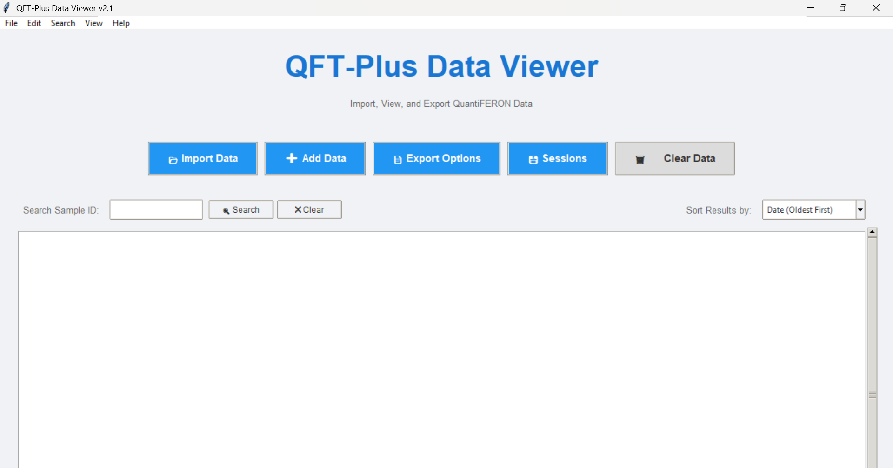

# 📊 QFT-Plus Data Viewer



A user-friendly desktop application built with Python and Tkinter designed to streamline the process of importing, visualizing, sorting, customizing, and exporting QuantiFERON-TB Gold Plus results generated by the Diasorin LIAISON® software.

---

## ✨ Key Features

*   **📁 Flexible Data Import:** Import results from single or multiple Excel (`.xlsx`, `.xls`) and CSV (`.csv`) files. Option to add data from new files to the current view without duplicates.
*   **🎨 Customizable Display:**
    *   Adjust background and text colors for Positive, Weak Positive, Negative, and Indeterminate results.
    *   Control the number of decimal places displayed for numeric values ('default', 0, 1, 2, 3).
*   **🔄 Advanced Sorting & Ordering:**
    *   Sort data by Request Date, Sample ID (Barcode), or QFT Result (ascending/descending).
    *   Manually reorder results via drag-and-drop style interface for specific presentation needs.
*   **📄 Versatile Exporting:**
    *   Generate professional, multi-page **PDF** reports with logos, headers, data tables (using custom colors), and a formatted summary page (Script 2 style).
    *   Export data to **Excel (`.xlsx`)** files, preserving formatting and cell colors based on results.
    *   Export raw data to **CSV (`.csv`)** files.
*   **💾 Session Management:**
    *   Save the current data view (including sorting and applied settings) as a named session to a local SQLite database.
    *   Load previously saved sessions.
    *   Manage sessions (view details, rename, delete).
    *   Automatic session backup before clearing data or importing new data over existing data.
*   **🔍 Global Search:**
    *   Search for specific Sample IDs (Barcodes) across *all* saved sessions.
    *   View results from different sessions in one place.
    *   Export selected (or all) search results to PDF, Excel, or CSV.
*   **🖥️ Modern GUI:** Intuitive interface built with Tkinter's themed widgets (ttk).

---

## 🚀 Getting Started

There are two ways to run the application:

### 1. Using the Executable (Recommended for most users)

1.  Download the latest `QFTPlusViewer.exe` file from the [Releases](https://github.com/AliSherif1309/QFT-Plus-Viewer/releases) page (You'll need to create releases on GitHub for this link to work).
2.  **Important:** Ensure the `resources` folder (containing `app_icon.ico`, `left_logo.png`, `right_logo.png`) is placed in the **same directory** as the `QFTPlusViewer.exe` file.
3.  Double-click `QFTPlusViewer.exe` to run the application. No installation is required.
4.  *(Note for first run):* A `qft_viewer_data` folder containing the database (`qft_database.db`) and settings (`qft_settings.json`) will be created in the same directory as the executable.

### 2. Running from Source Code

1.  **Prerequisites:**
    *   Python 3.x installed.
    *   Git installed (optional, for cloning).
    *   Required Python libraries: `pandas`, `reportlab`, `XlsxWriter`, `Pillow`.
2.  **Clone the Repository:**
    ```bash
    git clone https://github.com/AliSherif1309/QFT-Plus-Viewer.git
    cd QFT-Plus-Viewer
    ```
3.  **Install Dependencies:**
    ```bash
    pip install pandas reportlab XlsxWriter Pillow
    ```
    *(It's recommended to do this within a Python virtual environment)*
4.  **Run the Script:**
    ```bash
    python qft_viewer_final.py
    ```
    *(Replace `qft_viewer_final.py` with the actual name of your main Python script)*

---

## 🛠️ How to Use

1.  **Launch:** Run the executable or the Python script.
2.  **Import Data:**
    *   Use `File` > `Import/Export` > `Import Data...` (or the `📂 Import Data` button) to load data from Excel/CSV, replacing any current data.
    *   Use `File` > `Import/Export` > `Add Data...` (or the `➕ Add Data` button) to add unique records from files to the currently loaded data.
3.  **View & Sort:** Data is displayed in the main text area. Use the "Sort Results by:" dropdown to change the order.
4.  **Customize:** Use `View` > `Customize Appearance...` to change colors and decimal settings. Changes are saved automatically.
5.  **Manual Order:** Use `Edit` > `Manual Reorder...` to arrange rows in a specific custom order for export.
6.  **Export:**
    *   Use `File` > `Import/Export` > `Export Options...` (or the `📄 Export Options` button).
    *   Choose PDF, Excel, or CSV format in the dialog that appears.
7.  **Sessions:**
    *   Use `File` > `Session` > `Save Session` (or `Ctrl+S`) to save the current view.
    *   Use `File` > `Session` > `Manage Sessions...` (or `Ctrl+L`) to load, rename, or delete saved sessions.
8.  **Global Search:** Use `Search` > `Global Sample Search...` (or `Ctrl+F`) to find samples across all saved sessions and export those specific results.
9.  **Clear Data:** Use the `🗑️ Clear Data` button or `File` > `Clear Current Data` to remove the currently loaded data (you'll be prompted to save first).

---

## ⚙️ Technology Stack

*   **Python 3:** Core programming language.
*   **Tkinter (ttk):** Standard Python library for creating the graphical user interface.
*   **Pandas:** For efficient data loading and manipulation from Excel/CSV.
*   **ReportLab:** For generating professional PDF reports.
*   **XlsxWriter:** For creating formatted Excel (`.xlsx`) files.
*   **SQLite3:** Built-in Python module for the local session database.
*   **JSON:** For saving application settings.

---

## ⚠️ Disclaimer

This QFT-Plus Data Viewer is intended **solely for visualization and data formatting purposes.** It **does not perform any clinical calculations, interpretations, or modifications** of the underlying QuantiFERON result values. All quantitative results and initial interpretations (POS, NEG, IND) originate directly from the source Diasorin LIAISON® QuantiFERON software output files provided by the user. Use this tool as an aid for reporting and review, not as a replacement for clinical judgment or the original LQS software output.

---

## 🧑‍💻 Authors

*   **Hosam Al Mokashefy**
*   **Aly Sherif**

(AST Team) - © 2024